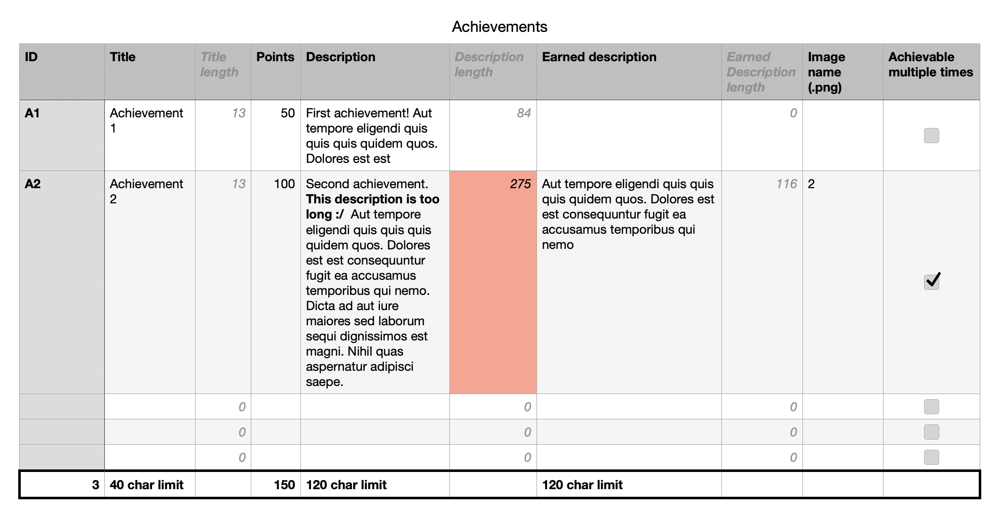

# Game Center Achievement Uploader
A python script to automate the repetitive process of adding Game Kit achievements to App Store Connect.

## What this does

- Allows you to **upload achievements** to App store connect in bulk, saving you hours
- Handles errors gracefully by saving them to disk
- Lets you work with all fields from app store connect: ID, title, points, description, earned description, achievable multiple times, hidden, and image.
- **Translates** the title, and descriptions to multiple other languages and adds those as localizations

### What this does NOT do:

- Work **concurrently**
- Allow you to **list** Game Center achievements or edit or delete them
- **Enable or disable Game Center** for a given app
- Allow you to have different images for each localization

## How to use

### Preparation
Usage is simple: firstly, [**install Python**](https://www.python.org/downloads/) from the official website, then install all the required libraries by running each line in **Terminal**:
```
pip3 install pyjwt cryptography
pip3 install requests
pip3 install translate
```

Now, **download the script** (upload_gk_achievements.py) and open with a text editor like Sublime text. At the top of the file, you can see some constants (in upper case) after the `### /// CONSTANTS \\\ ###` header. Edit these to meet your needs and **run** the script by entering in terminal `python3 path/to/upload_gk_achievements.py`.

### Formatting achievements

To process multiple achievements in bulk, the python script expects a **CSV** file containing all the achievements to process, and fields relevant to App Store connect. I would recommend **downloading the template .numbers** (or .xlsx) file and editing with Apple Numbers, Excel, or Google Sheets (you can add the .xlsx file to google drive and edit via Sheets), to add all of your achievements in.

Then, when you are finished, export as a CSV file (Numbers, Excel, and Sheets allow you to do this), and store ready for the python script.

**NOTE:** In the template .numbers spreadsheet provided, there are additional columns to count the characters for the desciptions and titles. App store connect has character limits on these fields, and the count box will go red if the title/description exceeds the character limit. For example:

**Example CSV:** (in Numbers)

Here, the description of the second achievement exceeds the rate limit of 255 characters, so the "Description length" box turns red, indicating that you should sorten it. Something similar happens with the points -- as the maximum points allowed between all achievements is 1,000 the points total at the bottom footer turns red if this is exceeded.

NOTE: The box color turning red is only checked on Apple Numbers.

### Understanding the output

As the python script processes the achievements serially, it outputs the stages it is at. Later you can learn about how it works but here is ain overview:

- `Reading achievements from CSV...`: This prints before reading the CSV file containing the Achievement data (provided as a constant)
- `Retrieved 35 from CSV file.`: Indicates the number of valid achievements found
- `Get GC detail: 200`: This prints after getting the associated Game Center detail idnetifier from App Store Connect API
- `Create GC achievements: 201`: This prints after creating an achievement
- `Create localization en-GB: 201`: This prints after creating a certain localization
- `Image reservation: 201`: This prints after reserving storage on Apple's server for the image
- `Upload image: 200`: This prints after uploading the image to Apple's server
- `Commit image addition 200`: This prints after the image addition is confirmed

### Understanding errors

If one of the stages above output an error HTTP code (i.e. 4XX) or anytihng other than the success (2XX) the **script does not stop**, or print details. Instead, once the script finishes, it saves errors to a **gk_achievements_upload_errors.txt** file in the user's home directory. This file contains a list of all the errors that occurred and the App Store Connect API response that lead to the error happening.

Examples of errors are:
```
ERROR creating the localization es-ES for 1Ldb5Wk:

{
  "errors" : [ {
    "id" : "5e6ca2f8-7a7d-466a-a241-bfebb0936079",
    "status" : "409",
    "code" : "ENTITY_ERROR.ATTRIBUTE.INVALID.TOO_LONG",
    "title" : "There is a problem with the request entity",
    "detail" : "The provided entity contains a field 'name' whose value is too long. It cannot exceed 50 characters.",
    "source" : {
      "pointer" : "/data/attributes/name"
    }
  } ]
}
		


ERROR creating achievement with ID 35:

{
  "errors" : [ {
    "id" : "2c42d542-5e2b-43cd-8ec5-4f65dcee73fe",
    "status" : "409",
    "code" : "ENTITY_ERROR.INVALID_POINTS_RANGE",
    "title" : "There is a problem with the request entity",
    "detail" : "You must provide points between 0 and 100 for an achievement.",
    "source" : {
      "pointer" : "/data/attributes/points"
    }
  }, {
    "id" : "d56c2fea-1e46-41a1-8b0c-b13d0e44e9a4",
    "status" : "409",
    "code" : "ENTITY_ERROR.INVALID_TOTAL_APP_POINTS",
    "title" : "There is a problem with the request entity",
    "detail" : "Total achievement points may not exceed 1000.",
    "source" : {
      "pointer" : "/data/attributes/points"
    }
  } ]
}
```

## How doers this script work?

This script uses the `csv` library to parse the CSV table of achievement data into an array of `Achievement` instances. Once it has done so, it acceses the _Game center detail_ (which is like a bridge between your app and game center) identifier, stopping the program if this could not be found. It uses JWT (JSON web tokens) for authentication as required by Apple. 

Once it has this identifier, it iterates over each achievement and uses the App Store Connect REST API to create an achievement with its ID, title, points, hidden, and wether it is repestable (all of which are found in the CSV file). Then, it adds the localizations (provided as a constant) to the achievement, using an achievement identifier, using a translation module to carry out language translations. It adds the pre-earned & earned descriptions to the achievement localization.

Now the localization is created, it follows a 3-step process to add an image to the localization: one being creating the achievement imge resource, 2 being uploading the image file, and 3 being committing the image upload.

While doing this, it adds errors to a list, which is saved to disk when the program comes to an end.

#### Enjoy :)
